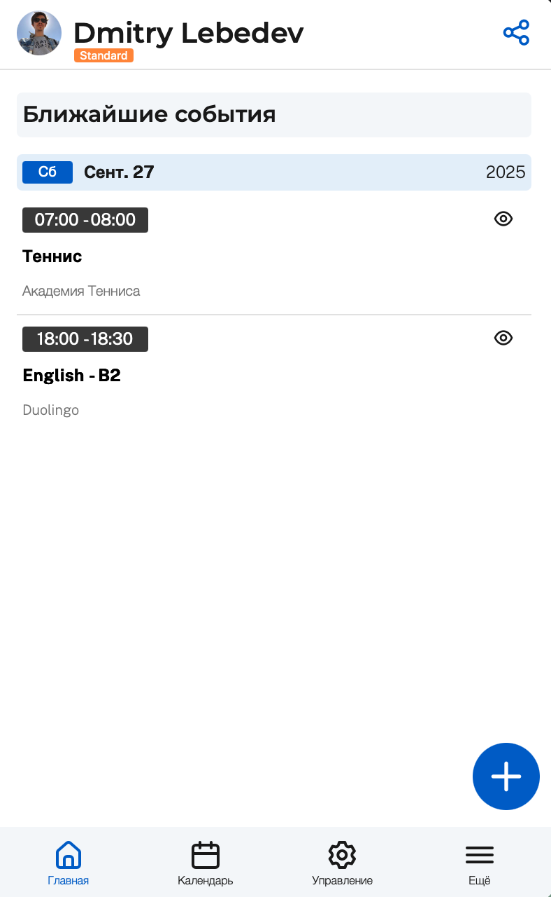

# Главная

<figure><figcaption>
Главная страница
</figcaption></figure>

Главная страница открывается при запуске приложения. Она предназначена для быстрого обзора актуальной информации и выполнения основных действий.

На экране отображаются:

### Профиль пользователя

В верхней части экрана отображается:

* Ваше имя и аватар из Telegram;
* Активный тарифный план. Если Вы находитесь на Free-плане, то справа от имени будет доступна кнопка "Улучшить".

### Кнопка "Поделиться календарем"

Иконка "Поделиться календарем" в правом верхнем углу экрана позволяет скопировать или отправить ссылку на ваш календарь. Это удобно для приглашения клиентов или коллег к бронированию.

### Ближайшие события

Под заголовком «Ближайшие события» вы видите список событий. Отображена следующая информация:

* Дата и день недели;
* Время события;
* Название и описание (если есть).

События отсортированы по дате — сверху самое ближайшее.

### Плавающая кнопка "Добавить событие"

Кнопка с плюсом в правом нижнем углу позволяет создать событие для бронирования
